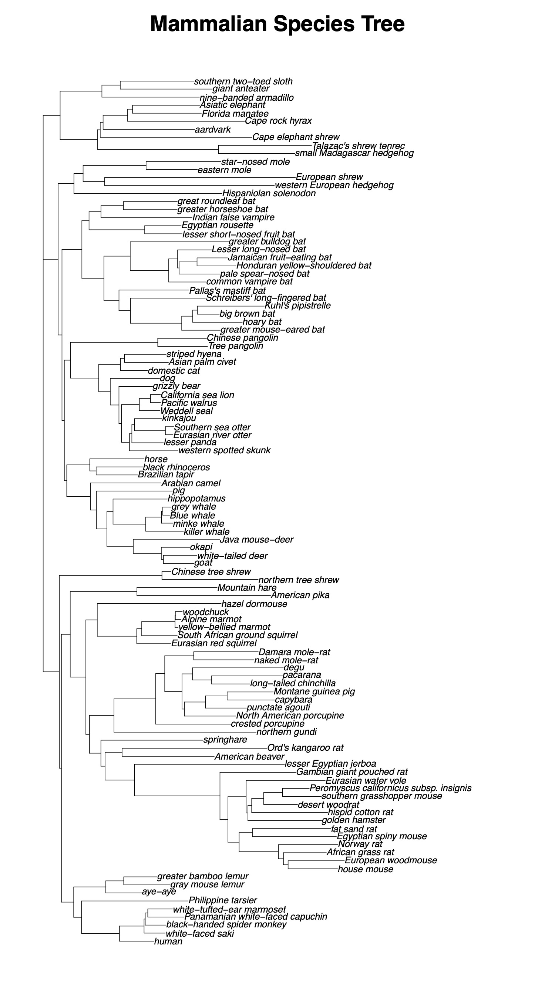
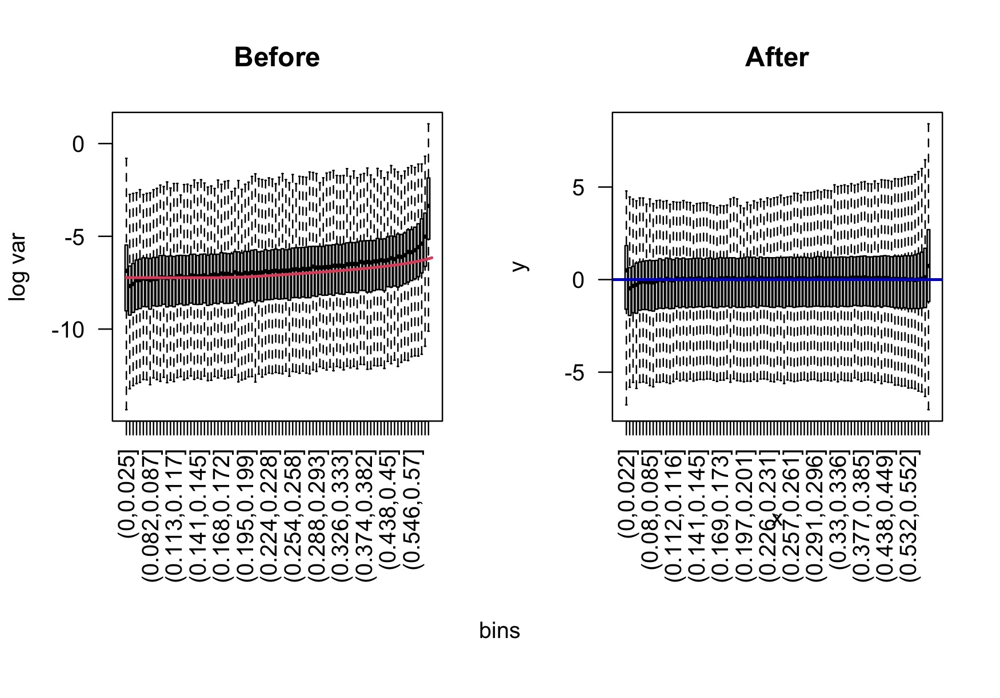
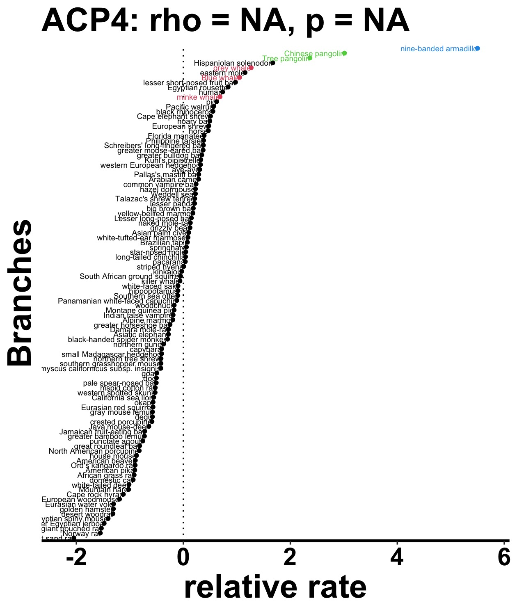
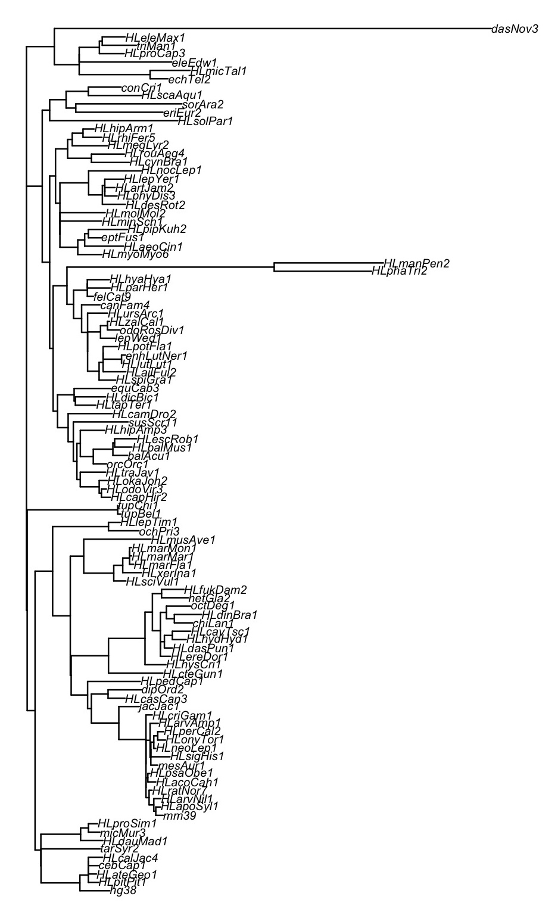
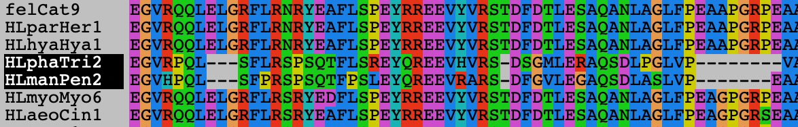
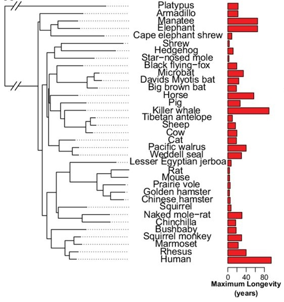

---
# Convergent Evolution of Tooth Enamel Loss in Mammals
## An RERconverge Demonstration
### Nathan Clark
### University of Pittsburgh
### 2026 January 21
---

## Overview

Convergent evolution provides a powerful natural experiment for identifying the genetic basis of complex traits. Selective pressures are constantly shifting and their action on individual genes changes over evolutionary time as species encounter new conditions.
As a particular gene becomes more important for fitness, its evolutionary rate will slow due to increased constraint and rejection of nearly neutral mutations. Conversely, if a gene is less important its rate will increase as some deleterious mutations fix in the species.
Finally, if positively selected changes to a gene accompany changing conditions in a species, the gene's evolutionary rate will similarly increase.
Thus, studying shifts in relative evolutionary rates (RERs) between species can reveal genes which are responding to selective pressures.
However, many genes will change rates in every species, so our ability to infer such connections relies on repeated evolutionary events, convergent evolution, so that we can associate a gene's shift with a specific selective pressure, phenotype, or environmental change.

One convergent evolutionary example in mammals is the **independent loss of tooth enamel**, which has occurred in multiple lineages including **pangolins**, **anteaters**, **armadillos** and **baleen whales**.
In this workshop, I demonstrate how to use **`RERconverge`** to identify genes whose evolutionary rates show **convergent shifts** associated with enamel loss. In other published contexts, we have similarly identified genes responding to convergent transitions of mammals to an aquatic and subterranean life, long lifespan, loss of hair, and high altitude.

**`RERconverge` has many functions and features not covered in this lab.
Full walkthroughs and documentation are available on the [RERconverge GitHub repository](https://github.com/nclark-lab/RERconverge)**
---

# Summary and Learning Objectives

By completing this handout, students should be able to:

- Explain how convergent evolution can be used to infer gene–trait associations
- Describe how RERconverge computes relative evolutionary rates
- Interpret correlations between evolutionary rates and binary traits

---

## Biological Background
Tooth enamel is the hardest tissue in vertebrates and requires a coordinated developmental program involving genes such as:
- *ENAM*
- *AMELX*
- *AMBN*
- *AMTN*
- *ANKRD11*
- *DSPP*
- *MMP20*

Lineages that no longer form mineralized teeth often exhibit **relaxed selection** or **pseudogenization** of these genes. RERconverge allows us to detect these patterns genome-wide by searching for those genes that consistently accelerate their RERs in toothless or enameless species.

---
## Data Requirements

This study requires:
1. A **species phylogeny** covering all taxa of interest
2. A set of **gene trees** (one per gene, same taxa)
3. A **binary phenotype** indicating enamel presence or absence

All trees are assumed to be in *Newick format*.

---
### Load or Install [R](https://www.r-project.org/) and possibly [R Studio](https://posit.co/download/rstudio-desktop/)
`module load r/4.5.0`

### Install packages (run once)
```{install r libraries}
install.packages("devtools")
install.packages("ape")
install.packages("phytools")
install.packages("phangorn")

install.packages("BiocManager")
BiocManager::install("ggtree")
BiocManager::install("impute")
BiocManager::install("Biostrings")
BiocManager::install("DECIPHER")

devtools::install_github("nclark-lab/RERconverge")
```

---
### Load Required Libraries

```{r libraries}
# Load RERconverge package. Dependencies will load automatically.
library(RERconverge)
```

---
## 108 mammalian species in the study
More than 400 mammalian species genomes are available today, the workshop uses a carefully chosen set of ~100 to improve runtime and to contain specific phenotypes for this study.
Read in the phenotypes table and examine the species using `read.csv()` and `View()` (only available in RStudio).

```
mammal108phenotypes = read.table("mammal108phenotypes.tsv", header=TRUE, sep="\t")
View(mammal108phenotypes)
```

## Species Phylogeny

**Mammalian species phylogeny used for RERconverge analysis.**  
Load and visualize the 108 mammal species tree we will use for the workshop.
The **`ape`** package provides the `read.tree()` function to read the tree from the "speciesTree108.nwk" file into a phylo object.
Then, `plot()` will automaticaly detect the phylo object and plot the phylogram.
This tree represents the shared evolutionary history of the mammalian taxa included in the analysis. Branch lengths reflect neutral evolutionary divergence and serve as the baseline against which gene-specific rate shifts are measured.

```{r species-tree}
# Load the species tree
speciesTree = read.tree("speciesTree108.nwk")

# Plot tree basic, with genome version names
par(mar=c(1,1,2,1)+0.1) # Change margin to make title fit.
plot(speciesTree, cex=0.5, edge.width = 0.5, main="Mammalian Species Tree", align.tip.label=F)

# Plot tree, with common names
speciesTreeCommon = speciesTree
speciesTreeCommon$tip.label = mammal108phenotypes[speciesTreeCommon$tip.label,"common_name"]
plot(speciesTreeCommon, cex=0.5, edge.width = 0.5, main="Mammalian Species Tree", align.tip.label=F)

```



---
# Preparing gene trees
Next, the study requires multiple sequence alignments (MSAs) of many orthologous gene sets from the common set of species  in the species phylogeny.
Not all species are required for each gene, RERconverge can handle sparse data, since orthologous gene sets always experience gains and losses naturally.

There are multiple potential sources for orthologous gene MSAs:
1. Download MSAs from projects such as [Zoonomia](https://zoonomiaproject.org/), the [Vertebrate Genomes Project](https://vertebrategenomesproject.org/), EMSEMBL, etc...
2. Extract genes from a whole-genome alignment of many species in HAL or MAF format.
3. Group and Align annotated genes from your species. Suggested to use OrthoFinder followed by OrthoSnap.
4. Download [Clark lab gene trees](https://github.com/nclark-lab/ComparativeData/wiki). (Alignments also available).

For this lab, we will use a demonstration set of MSAs available in the **`alignments`** directory. [Download alignments.zip here](https://pitt-my.sharepoint.com/:f:/g/personal/nclark_pitt_edu/IgBYR3CPWrWjQZ5mfrloQ8hpARMYAm84WkMXLu786CbPy_g?e=5y5NbH).
The alignments are in multiple-aligned fasta format `.mfa`. A mostly random set of 4,709 orthologous gene alignments were chosen for speed.  

> ## [History of FASTA format](https://en.wikipedia.org/wiki/FASTA#History)  
> FASTA is pronounced "fast A", and stands for "FAST-All", because it works with any alphabet, an extension of the original "FAST-P" (protein) and "FAST-N" (nucleotide) alignment tools.
> [Lipman, DJ; Pearson, WR (1985).](https://doi.org/10.1126%2Fscience.2983426)


## Examining a multiple sequence alignment in R or a stand-alone program.
The stand-alone alignment program `seaview` works on all platforms. Seaview is interactive and can do more than visualize alignments, such as infer phylogenies.
Download [SeaView](https://doua.prabi.fr/software/seaview).
Open `LIM2.mfa` or any `.mfa` file from `alignments`. `LIM2.mfa` is also available in the `alignments_test` directory.  


Alternatively, use the `DECIPHER` package in R to export an alignment image to your default web browser.
```{r LIM2 alignment}
library(Biostrings); library(DECIPHER); # Load required libraries
alnLIM2 = readAAStringSet("alignments/LIM2.mfa")
colors = c(`-`="#000000", `A`="#BDB1E8", `R`="#EFA2C5", `N`="#F6602F",
+             `D`="#FD5559", `C`="#12C7FE", `Q`="#DDACB4", `E`="#FEA097", `G`="#F46802",
+             `H`="#FCA708", `I`="#369BD9", `L`="#2E95EC", `K`="#CF7690", `M`="#4B8EFE",
+             `F`="#76997D", `P`="#FD2AE3", `S`="#A08A9A", `T`="#9A84D5", `W`="#74C80D",
+             `Y`="#9BB896", `V`="#89B9F9")
BrowseSeqs(alnLIM2,colors=colors,patterns=names(colors))
```
### Lens Instrinsic Membrane protein 2 (LIM2).
LIM2 encodes a protein important in lens function and hence vision.
Which species appear to have the most amino acid changes in otherwise conserved columns? Why these species?
You can use mammal108phenotypes table to translate genome versions to species common names.


---
# Calculating branch lengths
RERconverge includes tree-building functions that perform maximum likelihood branch length estimation given a fixed tree topology and alignments for each sequence of interest.
These functions are built directly on [`phangorn`](https://cran.r-project.org/web/packages/phangorn/index.html) functions `pml` and `optim.pml`, including arguments for parameters passed directly to those functions.
For more details on those functions, refer to `phangorn` documentation.

## Input file specification
Tree building functions require two inputs: a species tree topology and alignments from which to estimate branch lengths.
The species tree topology is strictly enforced, so all branch lengths are estimated for each gene, but the branching pattern is not inferred. A central assumption of RERconverge and other rates-based approaches is that the orthologous gene groups are all true orthologs.  

One must also name the output trees file in which to place all final trees. The trees file is used as direct input to RERconverge.

Estimating branch lengths for 4,709 genes with ~100 species takes hours, so pre-calculated tree are provided in the `allTrees.tre` file.  
For practice, run `estimatePhangornTreeAll()` on the `alignments_test` directory. It contains 5 alignments and should finish in a few minutes.

The function `estimatePhangornTreeAll` estimates branch lengths for all sequences included in the specified alignment directory.  This process is relatively slow - for example, it takes a couple minutes per gene to estimate branch lengths for most genes.  The user must specify, at minimum, the alignment director, a master tree file, and a desired output file.  Default function behaviors assume alignments are amino acid sequences in fasta format, and other arguments should be specified for other file and sequence types.

* `alndir`: filepath to the directory that contains alignments.  Alignment format may be any type specifiable to the phangorn `read.phyDat` function (phylip, interleaved, sequential, clustal, fasta, or nexus)
* `treefile`: filepath to master tree text file in Newick format
* `output.file`: filepath to desired location to save estimated trees.  Trees are written in Newick format in a single text file, the proper format to supply to the RERconverge `readTrees` function.
* `format`: string specifying the type of alignment file contained in `alndir`.  Defaults to "fasta", and options include "phylip", "interleaved", "sequential", "clustal", "fasta", and "nexus".
* `type`: string specifying sequence type, passed on to phangorn function `read.phyDat`.  Defaults to "AA", and options include "DNA", "AA", "CODON", and "USER".
* `submodel`: string specifying the substitution model to use when estimating tree branch lengths. Defaults to "LG", and options include "JC", "F81", "K80", "HKY", "SYM", and "GTR" - see phangorn documentation for additional options.
* `...`: other parameters, such as those specifying model fit parameters, are passed on to phangorn functions `pml` and `optim.pml`.

```{r results='hide', message = FALSE, warning = FALSE}
estimatePhangornTreeAll(alndir="alignments_test" , treefile="speciesTree108.nwk", output.file="treesTest.tre")
```

Note that default argument specification is appropriate for amino acid alignments in fasta format and uses the LG substitution model.  This may also be specified by including arguments format="fasta", type="AA", and submodel="LG".

For DNA sequences, the general time reversible model (GTR) is a popular substitution model.  When using `estimatePhangornTreeAll`, specify this model with the arguments type="DNA" and submodel="GTR".

---
## Reading in gene trees with `readTrees`

To run RERconverge, you will first need to supply a file containing **gene trees** for all genes to be included in your analysis. This is a tab delimited file with the following information on each line:

> Gene_name Newick_tree

Read in the gene trees using `readTrees()`. The `useSpecies` input variable can be provided to most RERconverge functions to select which species will be used. Excluding one or more species from this vector will exclude them from the analyses. We leave `useSpecies` null here, so all species will be used:
RERconverge is intended to be used on genome-scale datasets, containing a large number of gene trees with data present for all species. It thus has a minimum number of such gene trees required for `readTrees` to use to estimate a **master tree**; this is set with the `minSpec` option and is 20 by default.
If your dataset is smaller, you may adjust this or supply your own master tree using the option `masterTree` (this should be a `phylo` object generated using ape's `read.tree`); however, we recommend interpreting results with caution in this case.
If you want to read in less trees than your whole dataset for time purposes, set the `max.read` argument to however many gene trees you want it to read in.

```{r, cache = TRUE}
treesObj = readTrees(file="allTrees.tre" , useSpecies=NULL)
```

The screen output indicates there are 4709 items (gene trees) in the file and that the maximum number of tips in the gene trees is 108. 
Later, it reports that it will estimate the branch lengths for the background **master tree** using 4709 genes. 
The master tree will be used as background rate expectations for calculating **relative evolutionary rates**, *i.e.*, **RERs**.


---
# Computing **relative evolutionary rates (RER)** with `getAllResiduals`

The next step is to estimate **relative evolutionary rates**, or RERs, for all branches in the tree for each gene. Intuitively, a gene's RER for a given branch represents how quickly or slowly the gene is evolving on that branch relative to its overall rate of evolution throughout the tree.

Briefly, RERs are calculated by normalizing branch lengths across all trees by the master branch lengths. Branch lengths are then corrected for the heteroskedastic relationship between average branch length and variance using weighted regression. For a more detailed description of how RERs are computed, see [Partha et al. MBE 2017](https://academic.oup.com/mbe/article/36/8/1817/5488195).

We will use the `getAllResiduals` function to calculate RERs. This uses the following input variables (all the options set here are also the defaults):

-   `useSpecies`: a vector that can be used to specify a subset of species to use in the analysis. Here we will use the species in our AdultWeightLog vector that will be used for continuous trait analysis. Note that these are also the same species used for binary trait analysis. These species should be a subset of species included in `toyTrees$masterTree$tip.label`.
-   `transform`: the method used to transform the raw data. By transforming the raw data, we reduce the heteroscedasticity (relationship between mean and variance) and the influence of outliers. Here we will use a square-root transform ("sqrt"), which has performed the best at reducing heteroskedasticity in our datasets. Also available are "none" (no transformation) and "log" (natural logarithm transformation) and "asinh" (inverse hyperbolic sine transformation).
-   `n.pcs`: Number of principal components to normalize by (default: 0, mean normalization).
-   `use.weights`: whether to use a weighted regression to estimate RER. Weighting allows further correction for the relationship between mean and variance, which can be directly estimated from the data.
-   `weights`: Manual weights for a weighted regression. If these aren't provided, it uses ones generated in `readTrees`.
-   `norm`: A character string specifying the normalization method. Options include "scale," "zscore," or "quantile" (default is "scale").
-   The documentation provides other specific parameters for those who want to fine tune their analysis.

Here is the basic method, with the recommended settings:

```
rers = getAllResiduals(treesObj, transform = "sqrt", use.weights = T, norm="scale")
```

Part of the output of this function tells you that the cutoff is set to a value determined from the gene trees. Any branches shorter than this will be excluded from the analysis. It then calculates relative evolutionary rates for sets of gene trees.

The plots below generated by this function show the log variance of the RERs resulting from the original method (on the left) and the variance after transformation and weighted regression (on the right). Notice the heteroscedasticity (positive trend between values and their variance) that is present before the new transformation method is applied, is now gone. The x-axis displays bins of branch lengths on the tree, and the y-axis is the (log-scaled) variance in these branch lengths across trees. As you can see by comparing the right plot to the left plot, transforming and performing a weighted regression reduces the relationship between the mean branch length (x-axis) and the variance in branch length (y-axis). You can alter values for `transform`, `n.pcs`, `use.weights`, and `norm` to attempt to optimize heteroskedasticity correction.



Because it can take time to generate RERs for full-size datasets, save this RER object for later. Use R's `saveRDS` function. This will allow you to load it later with `readRDS`.

```{r, message = FALSE, cache = TRUE}
# Save for now as RDS file
saveRDS(rers, file="rer_mammal108.rds") 

# Reload quickly at a later time...
rers = readRDS("mammal108species.rds")
```

---
## Exploring RERs (relative evolutionary rates)
A branch RER reflects the result of past selective pressures on the gene over that branch.
A positive RER indicates that branch had more changes relative to the average expectation and results from a relaxation of constraint relative to other branches, or alternatively from positive selection for amino acid changes.
A negative RER indicates less change than expected relative to other branches, and results from higher selective constraint, supposedly because the gene was more important for fitness over that branch.  

Explore the RERs for Lens intrinsic membrane protein 2 (LIM2).
The `plotRers` function quickly shows the RERs for all terminal branches -- those that lead to extant species. The vertical ordering is meaningless and is just inverse alphabetical.
All internal branches of the species tree are stacked at the bottom.  

Which species have the highest RERs? What characteristic do those species share?  
Does this make sense for a lens protein?  Which selective regime led to this result?
```
plotRers(rermat=rers, index="LIM2", species_from = rownames(mammal108phenotypes), species_to = mammal108phenotypes[,"common_name"] )
```


Now explore the PERP gene on your own. PERP encodes a plasma membrane protein crucial for cell-cell adhesion, especially in stratified epithelial tissues like skin.
PERP and other structural proteins of the skin were shown to be under increased positive selection in aquatic mammals, presumably because they encounter a higher number and diversity of pathogens.  

```
plotRers(rermat=rers, index="PERP", species_from = rownames(mammal108phenotypes), species_to = mammal108phenotypes[,"common_name"] )
```


---

# Phenotype Definition: Tooth Enamel Loss

Now we will associate variation in these RERs with variation in a **binary trait** across the tree. To do so, we first need to provide information about which branches of the tree have the trait of interest (**foreground branches**). There are several possible ways to do this:

2)  Generate a binary tree from a vector of foreground species using `foreground2Tree`. This uses the following input variables (all the options set here are also the defaults):

-   `clade`: which of the branches within a foreground clade to keep as foreground. Options are "ancestral" to keep only the inferred transition branch, "terminal" to keep only terminal branches, and "all" to keep all branches.
-   `transition`: whether to allow only transitions to the foreground state ("unidirectional", the default) or both to and from the foreground state ("bidirectional"). Since we are considering transitions to a marine environment, which has only occurred in one direction within mammals, we use "unidirectional" (the default) here.
-   `weighted`: whether to distribute the "weight" of the foreground specification across all branches within each independent clade (default: FALSE).
-   `useSpecies`: a vector that can be used to specify a subset of species to use in the analysis. These should be the same species used to estimate RER.

2c) `clade = "all"`: Use maximum parsimony to infer where transitions from background to foreground occurred in the tree, and set those transition lineages, along with all daughter lineages, to foreground.

Teeth in general and tooth enamel has been lost independently in several mammalian lineages. These convergent events form the biological basis of this analysis, allowing us to search for genes showing repeated evolutionary rate shifts.

|common name|phenotype|genome identifier|
|------|-------|------|
|blue whale|toothless|HLbalMus1|
|grey whale|toothless|HLescRob1|
|minke whale|toothless|balAcu1|
|tree pangolin|toothless|HLphaTri2|
|Chinese pangolin|toothless|HLmanPen2|
|giant anteater|toothless|HLmyrTri1|
|nine-banded armadillo|no enamel|dasNov3|

### Set foreground species to species with your choice of:
1. no teeth
2. no teeth and no enamel
3. another binary trait (aquatic, subterranean, high altitude...) 

```{r}
# List your foreground species as genome identifiers in "quotes"
enamelForeground = c( "balAcu1", ... )
enamelForeground = c( "HLbalMus1", "HLescRob1", "balAcu1", "HLphaTri2", "HLmanPen2", "HLmyrTri1", "HLmyrTri1", "dasNov3" )

# Create a foreground "trait tree"
enamelTraitTree = foreground2Tree( enamelForeground, treesObj, clade="all" , weighted=TRUE)
```

`foreground2Tree` has encoded the trait as a phylogeny, in which the branch lengths indicate the phenotype. 
Zero branch lengths are background species and non-zero value branches are foreground species carrying the trait.
We used a `weighted=TRUE` analysis here to balance the influence of each independent trait convergence on the correlations.
Weights are displayed on foreground branches in the automatically produced trait tree plot.

**Figure 2. Independent losses of teeth and tooth enamel across mammals.**


---
## Generating **paths** using `tree2Paths` or `foreground2Paths`

Some of the genes (like BEND3 above) may not have data for all species, meaning that their phylogeny will be a subset of the full phylogeny. To plot RERs for these genes and to correlate them with trait evolution, we run one of two functions that determine how the trait would evolve along all/many possible subsets of the full phylogeny, generating a set of **paths**. The function `tree2Paths` takes a binary tree as input.

```
# Create a phenotype vector of paths
phenoEnamel = tree2Paths( enamelTraitTree, treesObj )
```

---

# Binary Trait Analysis
## Association of branch RERs with Enamel Loss
Now that we have estimates for the RERs for all genes of interest, as well as a representation of how the trait of interest evolves across the tree, we can use `correlateWithBinaryPhenotype` to test for an association between relative evolutionary rate and trait across all branches of the tree.

```
corEnamel = correlateWithBinaryPhenotype(rers, phenoEnamel, min.sp=10, min.pos=2, weighted="auto" )

# Add column of log-transformed P-values with directional sign of the correlation
corEnamel$stat = -log10(corEnamel$P) * sign(corEnamel$Rho)

# Add an additional multiple testing correction - False Discovery Rate
corEnamel$FDR = p.adjust(corEnamel$P, method = "fdr")
```

The text displayed shows which correlation method is used to test for association. Here it uses the default for weighted binary traits: a weighted Pearson.

The `correlateWithBinaryPhenotype` function generates a table with the following output for each gene:
1.  Rho: the correlation between relative evolutionary rate and trait across all branches
2.  N: the number of branches in the gene tree
3.  P: an estimate of the P-value for association between relative evolutionary rate and trait.
4.  p.adj: an estimate of the P-value adjusted for multiple comparisons using the Benjamini-Hochberg procedure (i.e., an estimate of the false discovery rate, or FDR).

Let's take a look at some of the top genes within this set.

```{r, message = FALSE, cache = TRUE}
head(corEnamel[order(corEnamel$P),])

head(corMarine[order(corMarine$stat, decreasing = TRUE),])
```

Because we might expect different sets of genes to be in the positively or negatively correlated groups,
it can be helpful to sort the table by the log-transformed p-values that carry the sign of Rho i.e. the "stat".
Examining the extreme top or bottom of this sorting shows top positively and negatively correlated genes.

#### For easy viewing and interactive sorting in RStudio use: `View(corEnamel)`

---

# Interpretation

- **Positive correlation (Rho > 0)**  
  → Accelerated evolution in enamel-less mammals (relaxed constraint)

- **Negative correlation (Rho < 0)**  
  → Increased constraint or compensatory selection

Expected findings include:

- Strong signals in enamel matrix genes (*ENAM*, *AMELX*)
- Enrichment for tooth development and epithelial pathways
- Evidence of repeated pseudogenization events


## Significant Genes
Genes with **FDR < 0.05** are considered significantly associated with enamel loss.

Which interesting genes do you observe? Consult the list of enamel genes in the **Biological Background** and pick a few others to research on your own.

### *ACP4* is an interesting genes in the significantly positive-correlated end of the `stat`.
#### Let's examine its RER plot. Here we are sorting the species by RER value with `sortrers` and coloring the foreground clades with `phenv`

```
plotRers(rers, "ACP4", phenv = phenoEnamel, sortrers = TRUE, species_from = rownames(mammal108phenotypes), species_to = mammal108phenotypes[,"common_name"])
```



#### Let's now examine the tree of ACP4 itself.  
The long branches in ACP4 have high RERs because their length is much greater than in the species tree, which uses average divergence across many genes.
```
plot(treesObj$trees$ACP4, cex=0.5)
```


#### Finally open ACP4's alignment using one of the two methods introduced before.
Here's a small portion of ACP4 for a few species. The 2 pangolins are highlighted.



Questions:
1. Do you see the abnormally long branch lengths for certain species in ACP4's tree?
2. In ACP4's alignment, can you see evidence of excess divergence in the armadillo (dasNov3)?
3. What is the likely cause for the accelerated divergence in this species?
4. Based on these observations, do you think that ACP4 has other biological functions outside of enamel formation?

---
# Gene Set Enrichment Analysis
A common downstream analysis in genomics to to ask which gene annotations are enriched among the top-scoring genes.
Enriched functions, pathwyas, or molecular characteristics help us make sense of what we have discovered at a higher level than single genes.
It can also help us to not over-interpret the significance result of a single gene when making our final conclusions with the best possible consideration.  

There are many enrichment analysis programs available. We will use a simple web-based tool, [GOrilla](https://cbl-gorilla.cs.technion.ac.il/), which operates on Gene Ontology annotation terms.

## Deriving a ranked gene list

We will perform our enrichment on Rho-signed negative log p-values from our correlation results. 
The *getStat* function converts our correlation results to these values, removes NA values, and returns a named numeric vector where names correspond to rownames from the correlation results (in this case, gene names).
We then write this to a file "ranked_enamel_genes.txt" containing all genes listed from highest rate acceleration in species without enamel to the lowest deceleration.

```
stats = getStat(corEnamel)
write( names( sort(stats, decreasing = TRUE) ), "ranked_enamel_genes.txt" )
```

Use this ranked list of genes for import into [GOrilla](https://cbl-gorilla.cs.technion.ac.il/).

- Step 1: Choose "Homo sapiens"
- Step 2: Choose "Two unranked lists"
- Step 3: Into the "Target set" paste in the top ~10 to ~100 genes from `stats.txt` (your choice)
          Into "Background set" paste the entire gene list
- Step 4: Choose ontology: "Process"

The output shows with Gene Ontology Biological Processes were enriched in your top N genes.
Pay attention to the table at the bottom of the page, its term **Descriptions**, **P-values** and **Enrichment** factors. There are nice explanations of the output below the table.  
Remember that we are operating on a random subset of the genome, and statistical power will be better with the entire genome.  

Do the categories you see make sense?  

Which do not make sense? Could you offer an explanation?
In our study of this trait, it is important to account for traits that are coincidental in these species.
The major example being the loss of body hair in the whales, pangolins, and armadillo, which makes certain hair proteins like keratins appear accelerated in this study as well.
The solution to these competing convergent traits is to weigh evidence for each alternative hypothesis (hair...) for each gene using **Bayes Factors**.
We employed this in our study of hair in [Kowalczyk, Chikina, & Clark. *eLife* 2022](https://elifesciences.org/articles/76911), in which each gene was sorted into the best fitting convergent trait.

Try variations of the enrichment analysis, such as different numbers of top genes, different ontologies, or the ranked list choice in Step 2.

---
## You can also try [RERconverge's gene set enrichment analysis](https://github.com/nclark-lab/PhyloGenomicsLab/tree/main/lab_docs/enrichment_analysis.md)
Enrichment analysis in RERconverge can be customized and fine-tuned for your study.
It also accepts any annotations, even for non-model organisms, including custom annotations in a simple format.
Learn how to use it in this [lab extension](https://github.com/nclark-lab/PhyloGenomicsLab/tree/main/lab_docs/enrichment_analysis.md).


---
# Conclusions

This analysis illustrates how **RERconverge** leverages convergent phenotypic evolution to identify genes underlying complex traits. 
Tooth enamel loss provides a clear, biologically interpretable example where evolutionary rate shifts reflect repeated relaxation of developmental constraints.

Which traits would you like to examine?

This lab studies the loss of a trait, which usually produces accelerations of key genes due to relaxed constraint or even pseudogenization.
What is an example of a trait that required adaptive changes instead?


---
# Extensions
To learn more about comparative genomics approaches, consider the following extensions into continuous traits using **RERconverge** and *d*~N~/*d*~S~-based analysis of positive selection on foreground species using **BUSTED-PH**.

---
## Continuous Trait Analysis -- Long lifespan in Mammals



If you've finished binary trait analysis, you can explore RERconverge's pipeline to study more complex traits with its [continuous trait analysis](https://github.com/nclark-lab/PhyloGenomicsLab/tree/main/lab_docs/continuous_traits.md) capabilities.

In the [continous trait lab](https://github.com/nclark-lab/PhyloGenomicsLab/tree/main/lab_docs/continuous_traits.md), you will use your mammalian dataset to explore lifespan and the genes that change their selective regimes in long-lived *versus* short-lived species.
A similar study is reported in [Kowalczyk et al. *eLife* 2020](https://elifesciences.org/articles/51089).


---
## Postive selection on foreground branches
[BUSTED-PH](https://github.com/veg/hyphy-analyses/tree/master/BUSTED-PH) (PH for "phenotype") is a set of likelihood models composed to specifically test for positive selection on foreground branches, but also to differentiate that from any positive selection (if present) on background branches as well.
By considering the background branches, BUSTED-PH can identify genes that are uniquely under positive selection during a foreground-specific event, thus making much sharper conclusions than previous branch-site *d*~N~/*d*~S~ models.
The [BUSTED-PH GitHub](https://github.com/veg/hyphy-analyses/tree/master/BUSTED-PH) has full tutorial and documentation.


---

# Reading

- [Chkina et al. 2016 *MBE* Hundreds of genes experienced convergent shifts in selective pressure in marine mammals](https://academic.oup.com/mbe/article/33/9/2182/2579331)
- [Partha et al. 2017 *eLife* Subterranean mammals show convergent regression in ocular genes and enhancers, along with adaptation to tunneling](https://elifesciences.org/articles/25884)
- [Partha et al. 2019 *MBE* Robust method for detecting convergent shifts in evolutionary rates](https://academic.oup.com/mbe/article/36/8/1817/5488195)
- [Kowalczyk et al. 2020 *eLife* Pan-mammalian analysis of molecular constraints underlying extended lifespan](https://elifesciences.org/articles/51089)
- [Kowalczyk et al. 2022 *eLife* Complementary evolution of coding and noncoding sequence underlies mammalian hairlessness](https://elifesciences.org/articles/76911)
- [Clark, Kowalczyk, Kopania. 2025 *Ann Rev Genetics* Phylogenomic Approaches to Study Adaptive Evolution in Mammals: From Aging to Aquatic Lifestyles](https://www.annualreviews.org/content/journals/10.1146/annurev-genet-030325-041233)


